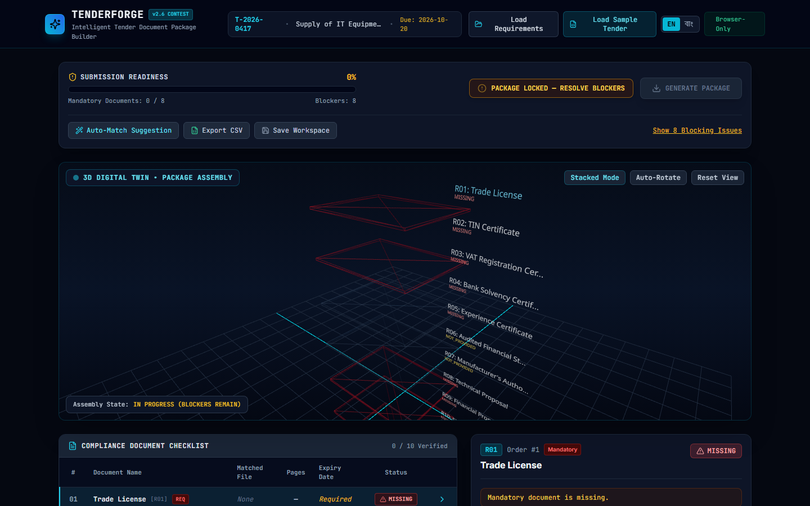
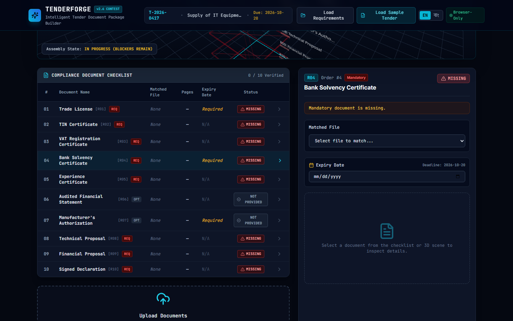
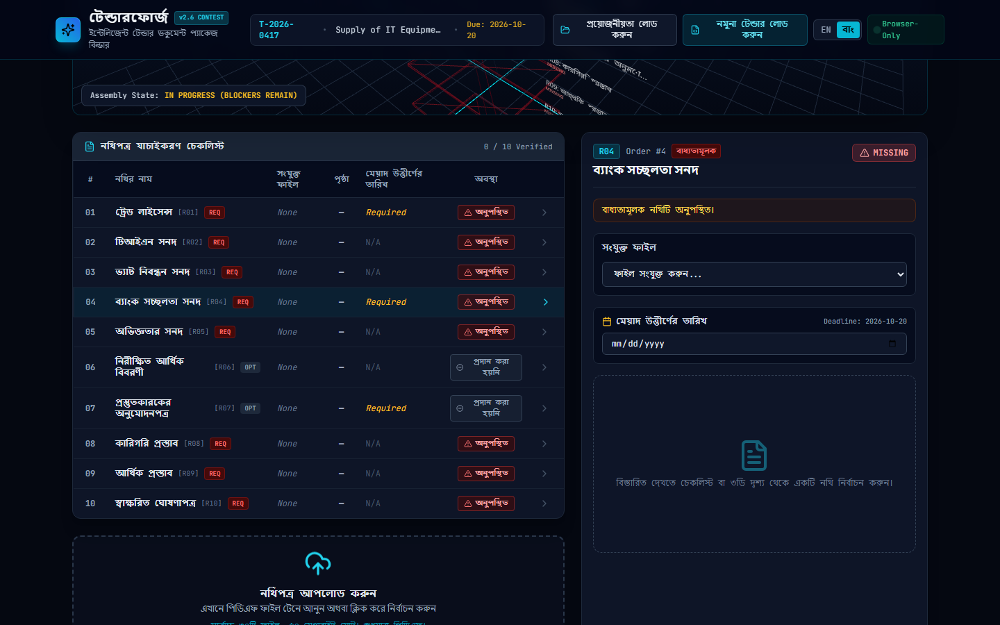
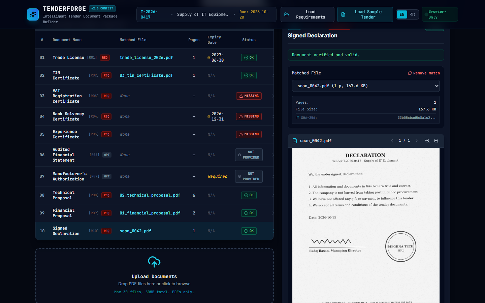

# TENDERFORGE
### *Intelligent Tender Document Package Builder*

> **Daffodil International University AI DevFest 2026 — AI Vibe-Coding Contest (Solo)**  
> **Author:** Bornil Mahmud  
> **Email:** bornilprof@gmail.com  
> **Repository:** [https://github.com/BornilMahmud/devfestVC026.git](https://github.com/BornilMahmud/devfestVC026.git)  
> **Live Web Application:** [https://bornilmahmud.github.io/devfestVC026/](https://bornilmahmud.github.io/devfestVC026/) *(or local Vite dev server)*

---

## 1. Project Overview & Purpose

**TENDERFORGE** is an enterprise-grade, client-side digital twin and document operations workspace engineered for public procurement and corporate tender compliance. It eliminates tender disqualification risks caused by missing documents, expired statutory certifications, incorrect ordering, and duplicate attachments.

Built under strict **100% Frontend-Only** contest constraints, all file parsing, cryptographic content hashing, validation rule checking, in-browser PDF rendering, and multi-document PDF merging execute entirely in the user's browser using modern Web APIs (`crypto.subtle`, `pdf-lib`, `pdfjs-dist`). **Zero participant servers, backend APIs, or external storage services are involved.**

---

## 2. Key Features & Contest Specification Adherence

### 2.1 Core In-Browser Document Processing
- **Strict Frontend Architecture**: No Node/Express backend, no Python server, no serverless functions, no Firebase, no Supabase, and zero network data exfiltration. All files remain local to the user's browser.
- **Dynamic Tender Specification Parser**: Accepts arbitrary `requirements.json` definitions (supports tender metadata, ascending order sorting, bilingual EN/BN titles, mandatory flags, and expiry flags). Never hardcodes requirement IDs or names.
- **Client-Side Cryptographic Deduplication**: Calculates SHA-256 content digests for all uploaded files via `window.crypto.subtle.digest('SHA-256', buffer)`. Files with identical byte contents (even with altered filenames such as `cert.pdf` vs `cert (1).pdf`) are flagged as duplicate conflicts and blocked from conflicting requirement assignments.
- **Page Counting & Bad File Resilience**: In-browser page counting and rendering via `pdfjs-dist`. Non-PDF files (e.g. `.png`, `.docx`) and damaged/encrypted PDFs are detected gracefully with user-friendly error banners without crashing the application.
- **Enforced Safety Guardrails**: Upload limits set to **maximum 30 files** and **50 MB total aggregate size**.

### 2.2 Deterministic Validation Engine
A single centralized, pure validation function (`evaluateRequirements`) calculates the exact status for every requirement:
- **`OK`**: File attached and valid. If statutory expiry is required, `expiry_date >= submission_deadline`.
- **`MISSING`**: Mandatory requirement without an assigned file (Blocking).
- **`EXPIRY DATE NEEDED`**: File assigned to an expiry-required slot without an entered date (Blocking).
- **`EXPIRED`**: Entered expiry date is strictly before the submission deadline `YYYY-MM-DD` (Blocking).
- **`NOT PROVIDED`**: Optional requirement left unassigned (Non-blocking).

### 2.3 Interactive 3D Package Digital Twin (React Three Fiber)
3D is not a decorative gimmick in TenderForge—it acts as an active physical representation of the document assembly:
- **Real-Time Layer Rendering**: Each attached document is modeled as a tactile document sheet proportional to page weight, while missing requirements render as glowing translucent wireframe placeholder slots.
- **Interactive Camera Controls**: Orbit, pan, zoom, smooth camera refocusing upon selecting any requirement, and toggles for Auto-Rotate and Exploded Layer Stack view.
- **Visual Status Signifiers**:
  - Green neon edges: Validated & compliant (`OK`).
  - Pulsing amber: Missing expiry date (`EXPIRY DATE NEEDED`).
  - Warning crimson: Expired certificate or duplicate conflict (`EXPIRED`).
  - Cyan translucent wireframe: Missing mandatory slot (`MISSING`).
- **WebGL Graceful Fallback**: If WebGL context creation fails on low-end hardware, a clean 2D document layer matrix displays automatically.

### 2.4 Audit-Grade PDF Package Generator (`pdf-lib`)
Generates a downloadable, ready-to-submit tender package named `<tender_id>_Package.pdf` (e.g., `T-2026-0417_Package.pdf`):
- **Page 1 (Cover Page)**: Clean English cover page compliant with public procurement regulations (Tender ID, Tender Title, Procuring Entity, Bidder Name, Submission Deadline, Generation Timestamp, and Complete Document Inventory).
- **Page 2 (Table of Contents / Index Page)**: Automatically calculated starting page numbers for every included document section.
- **Merged Source Documents**: All pages of each matched document preserved in exact requirement order (`order` ascending). Unprovided optional files are cleanly excluded.
- **Persistent Audit Footers**: `<tender_id> | Page X of Y` drawn on the bottom border of every single page (including Cover and Index), where `Y` is the accurate total page count of the compiled package.

### 2.5 Bilingual Interface (English & বাংলা)
- Instant top-bar language toggle switches the entire UI, status badges, buttons, guidance tooltips, and requirement names (`title_en` vs `title_bn`).
- Cover page remains strictly in English per tender regulation standards.

### 2.6 Bonus Capabilities
- **Smart Auto-Match**: Normalized heuristic algorithm matching uploaded file names to requirement titles (with distinct "Suggested Match" chips).
- **CSV Audit Export**: Instant export of compliance status table to CSV (`<tender_id>_checklist.csv`).
- **In-Browser Document Canvas Preview**: Multi-page PDF viewer with zoom controls.
- **Local Project Persistence**: Auto-saves and restores state via browser `localStorage`.

---

## 3. UI Screenshots

| Main 3D Digital Twin Interface | Submission Validation & Readiness |
| :---: | :---: |
|  |  |

| Complete Bangla Localization (বাংলা) | Package Ready & Final Assembly |
| :---: | :---: |
|  |  |

---

## 4. Getting Started & Running Locally

### Prerequisites
- Node.js 18+ or 20+
- Modern Web Browser (Google Chrome 110+, Microsoft Edge, or Firefox)

### Installation
```bash
# Clone the repository
git clone https://github.com/BornilMahmud/devfestVC026.git
cd devfestVC026

# Install dependencies
npm install
```

### Development Server
```bash
# Start Vite development server
npm run dev
```
Open [http://localhost:5173](http://localhost:5173) in your browser.

### Automated Test Suite
```bash
# Run the validation & duplicate detection verification suite
npm test
```

### Production Build & Preview
```bash
# Build production bundle
npm run build

# Preview production build locally
npm run preview
```

---

## 5. Technology Stack

| Layer | Technologies |
| :--- | :--- |
| **Framework & Core** | React 18, Vite 5, TypeScript 5 |
| **Styling & UI Tokens** | Tailwind CSS 3, Lucide React, Framer Motion |
| **3D Digital Twin Engine** | Three.js (r164), @react-three/fiber (v8), @react-three/drei (v9) |
| **PDF Processing & Hashing** | pdf-lib (v1.17.1), pdfjs-dist (v3.11.174), Web Crypto API (`SHA-256`) |
| **Celebration VFX** | Canvas-Confetti |
| **Testing & CI Verification** | Headless Chrome Verification, Node verification scripts |

---

## 6. AI Development & Contest Protocol

### AI Tools Used
- **Google Antigravity AI Coding Agent** (Advanced Agentic Coding Environment)
- **Claude 3.7 Sonnet / Gemini 2.5 Flash** reasoning engine

### Most Useful AI Prompts During the Build
1. **Core Verification & Duplication**:
   > *"Implement client-side SHA-256 hashing using Web Crypto to group uploaded PDFs by byte content and flag exact duplicates. Structure a centralized deterministic validation engine comparing document expiry dates against submission deadlines."*
2. **3D Digital Twin Architecture**:
   > *"Build a React Three Fiber scene representing tender requirements as 3D document slabs with dynamic page thickness, translucent wireframes for missing slots, and camera focus animations linked to table selection."*
3. **Audit-Grade PDF Compiler**:
   > *"Compile a multi-document PDF with an official English cover page, dynamic table of contents index, and persistent '<tender_id> | Page X of Y' footers across all pages without clipping original document content."*

---

## 7. License

Distributed under the **MIT License**. See [`LICENSE`](LICENSE) for details.